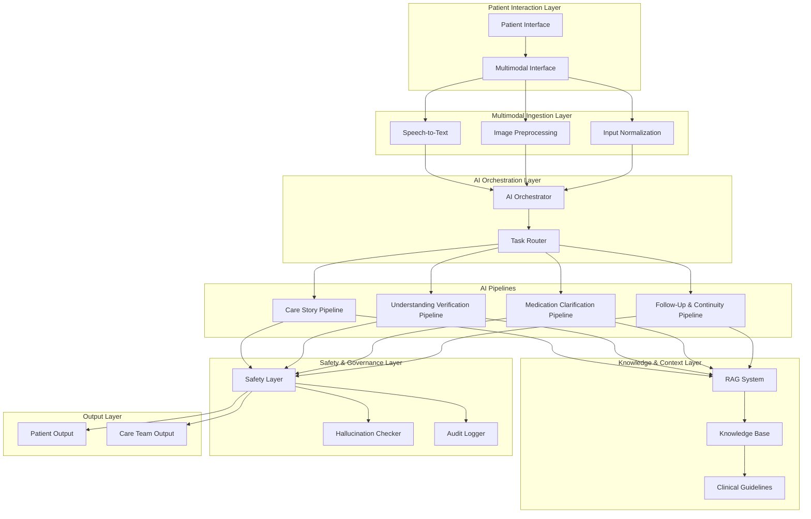

# Design Document

## Overview

CARETALE AI is a post-discharge multimodal care companion system designed to bridge the critical gap between hospital discharge and successful home recovery. The system transforms complex medical discharge documentation into accessible, personalized care narratives while providing ongoing multimodal support through a layered, modular architecture.

The design prioritizes patient safety through controlled agentic behavior, medical scope boundaries, and robust hallucination detection. Built on a foundation of evidence-based clinical guidelines accessed through Retrieval-Augmented Generation (RAG), the system ensures all guidance is grounded in authoritative medical sources while maintaining strict governance controls.

Key design principles include:
- **Safety-First Architecture**: Multiple layers of safety checks and medical scope boundaries
- **Multimodal Accessibility**: Support for text, voice, and image interactions with inclusive design
- **Modular Scalability**: Independent, loosely-coupled components for easy maintenance and growth
- **Evidence-Based Responses**: All medical guidance grounded in approved clinical guidelines
- **Responsible AI**: Transparent, auditable, and ethically-designed AI interactions

## Architecture

The system follows a layered architecture with clear separation of concerns and well-defined interfaces between components. This design enables independent scaling, testing, and maintenance of each layer while ensuring robust security and safety controls.



### Layer Responsibilities

**Patient Interaction Layer**: Provides accessible, multimodal interfaces supporting text, voice, and image inputs with comprehensive accessibility features including screen reader compatibility and multiple language support.

**Multimodal Ingestion Layer**: Processes diverse input types through specialized components for speech-to-text conversion, image preprocessing, and input normalization to create consistent internal representations.

**AI Orchestration Layer**: Routes patient requests to appropriate specialized pipelines based on request analysis and maintains coordination between multiple pipelines for complex requests.

**AI Pipelines**: Four specialized pipelines handle distinct aspects of patient care support, each optimized for specific use cases while maintaining consistent interfaces.

**Knowledge & Context Layer**: Provides evidence-based medical context through RAG architecture, ensuring all responses are grounded in approved clinical guidelines and educational content.

**Safety & Governance Layer**: Enforces medical scope boundaries, detects potential hallucinations, maintains audit trails, and ensures all outputs meet safety and compliance requirements.

**Output Layer**: Formats responses for both patients (accessible care guidance) and care teams (insights and alerts) while integrating with existing healthcare workflows.

## Components and Interfaces

### Patient Interaction Layer

**Multimodal Interface Component**
- **Purpose**: Provides unified access point for all patient interactions
- **Inputs**: Text messages, voice recordings, images, accessibility commands
- **Outputs**: Formatted responses in text, audio, or visual formats
- **Key Features**:
  - WCAG 2.1 AA compliance for accessibility
  - Multi-language support with cultural sensitivity
  - Adaptive interface based on patient capabilities and preferences
  - Real-time response formatting and delivery

**Interface Specifications**:
```typescript
interface MultimodalInterface {
  processTextInput(text: string, patientId: string): Promise<Response>
  processVoiceInput(audio: AudioBuffer, patientId: string): Promise<Response>
  processImageInput(image: ImageBuffer, patientId: string): Promise<Response>
  formatResponse(content: string, format: OutputFormat): Promise<FormattedResponse>
  getAccessibilityOptions(patientId: string): AccessibilitySettings
}
```

### Multimodal Ingestion Layer

**Speech-to-Text Component**
- **Purpose**: Converts patient voice inputs to text for processing
- **Technology**: Cloud-based ASR with healthcare-specific vocabulary
- **Features**: Noise reduction, medical terminology recognition, multi-accent support
- **Privacy**: On-device processing option for sensitive content

**Image Preprocessing Component**
- **Purpose**: Analyzes patient-submitted images for relevant medical context
- **Capabilities**: Medication identification, wound assessment, medical device recognition
- **Safety**: Strict scope limitations, no diagnostic capabilities
- **Output**: Structured image analysis with confidence scores

**Input Normalization Component**
- **Purpose**: Creates consistent internal representations from diverse inputs
- **Functions**: Text cleaning, entity extraction, intent classification
- **Output**: Standardized request objects for orchestrator routing

### AI Orchestration Layer

**AI Orchestrator Component**
- **Purpose**: Central routing and coordination hub for all AI pipeline interactions
- **Routing Logic**: Intent-based routing with fallback mechanisms
- **Coordination**: Manages multi-pipeline requests and response integration
- **Monitoring**: Tracks pipeline performance and implements circuit breakers

**Task Router Specifications**:
```typescript
interface TaskRouter {
  analyzeRequest(request: NormalizedRequest): RequestAnalysis
  routeToPipeline(analysis: RequestAnalysis): Pipeline[]
  coordinateMultiPipeline(pipelines: Pipeline[], request: NormalizedRequest): Promise<CoordinatedResponse>
  handleFailover(failedPipeline: Pipeline, request: NormalizedRequest): Promise<Response>
}
```

### AI Pipelines

**Care Story Pipeline**
- **Purpose**: Transforms discharge notes into patient-friendly care narratives
- **Input**: Structured discharge documentation, patient preferences
- **Processing**: Natural language generation with health literacy optimization
- **Output**: Personalized care stories with clear action items and timelines
- **Safety**: Content validation against original discharge instructions

**Understanding Verification Pipeline**
- **Purpose**: Detects patient confusion and generates targeted clarifications
- **Input**: Patient questions, conversation history, care context
- **Processing**: Confusion detection algorithms, clarification generation
- **Output**: Alternative explanations, examples, and escalation triggers
- **Feedback Loop**: Learns from successful clarification patterns

**Medication Clarification Pipeline**
- **Purpose**: Provides clear medication guidance and education
- **Input**: Medication lists, patient questions, interaction history
- **Processing**: Drug information synthesis, interaction checking
- **Output**: Plain-language medication explanations with timing and importance
- **Safety**: No prescription modifications, clear scope boundaries

**Follow-Up & Continuity Pipeline**
- **Purpose**: Manages care plan reminders and engagement tracking
- **Input**: Care plans, patient preferences, engagement data
- **Processing**: Reminder scheduling, engagement analysis, re-engagement strategies
- **Output**: Personalized reminders, progress tracking, care team alerts
- **Adaptation**: Learns optimal timing and communication preferences

### Knowledge & Context Layer

**RAG System Architecture**
Based on research findings, the RAG system implements a "show your work" architecture that dramatically reduces hallucination risks through grounded responses with verifiable citations.

**Components**:
- **Document Retriever**: Semantic search across clinical guidelines using dense vector embeddings
- **Re-ranker**: Relevance scoring and context selection for optimal response grounding
- **Citation Generator**: Transparent source attribution for all medical information
- **Knowledge Base Manager**: Maintains curated library of approved clinical sources

**RAG Implementation**:
```typescript
interface RAGSystem {
  retrieveRelevantDocs(query: string, domain: MedicalDomain): Promise<Document[]>
  rerankByRelevance(docs: Document[], query: string): Promise<RankedDocument[]>
  generateGroundedResponse(query: string, context: RankedDocument[]): Promise<GroundedResponse>
  validateCitations(response: GroundedResponse): Promise<ValidationResult>
}
```

**Knowledge Base Structure**:
- **Clinical Guidelines**: Evidence-based protocols from authoritative medical organizations
- **Educational Content**: Patient-friendly explanations of medical concepts and procedures
- **Drug Information**: Comprehensive medication databases with interaction data
- **Care Protocols**: Standardized care pathways for common post-discharge scenarios

### Safety & Governance Layer

**Safety Layer Architecture**
Implements multiple safety mechanisms based on healthcare AI best practices, including medical scope boundary enforcement and real-time hallucination detection.

**Medical Scope Boundaries**:
- **Diagnostic Prohibition**: Prevents any diagnostic suggestions or medical interpretations
- **Treatment Restrictions**: Blocks treatment recommendations beyond discharge instructions
- **Emergency Detection**: Identifies urgent situations requiring immediate medical attention
- **Escalation Triggers**: Automatic care team notifications for concerning interactions

**Hallucination Detection System**
Based on recent research in healthcare AI safety, implements multi-layered hallucination detection:

```typescript
interface HallucinationDetector {
  validateFactualConsistency(response: string, sources: Document[]): Promise<ConsistencyScore>
  checkMedicalAccuracy(response: string, domain: MedicalDomain): Promise<AccuracyScore>
  detectConfabulation(response: string, context: ConversationContext): Promise<ConfabulationRisk>
  flagForReview(response: string, riskScore: number): Promise<ReviewFlag>
}
```

**Audit and Compliance**:
- **Interaction Logging**: Complete audit trail of all patient interactions
- **HIPAA Compliance**: End-to-end encryption and access controls
- **Quality Monitoring**: Continuous monitoring of response quality and safety
- **Regulatory Reporting**: Automated compliance reporting and incident tracking

### Output Layer

**Patient Output Formatter**
- **Accessibility**: Multiple format options (text, audio, visual) with accessibility features
- **Personalization**: Adapts language complexity and cultural context
- **Clarity**: Uses plain language principles and health literacy best practices
- **Engagement**: Interactive elements and progress tracking

**Care Team Integration**
- **Insights Dashboard**: Patient engagement patterns and education gaps
- **Alert System**: Automated notifications for concerning patient interactions
- **Progress Reports**: Structured summaries of patient care plan adherence
- **Workflow Integration**: Compatible with existing EHR and care management systems

## Data Models

### Core Data Structures

**Patient Profile**
```typescript
interface PatientProfile {
  patientId: string
  demographics: Demographics
  accessibilityNeeds: AccessibilitySettings
  languagePreferences: LanguageSettings
  healthLiteracyLevel: HealthLiteracyLevel
  communicationPreferences: CommunicationPreferences
  careContext: CareContext
}
```

**Care Context**
```typescript
interface CareContext {
  dischargeDate: Date
  dischargeDiagnosis: string[]
  careInstructions: CareInstruction[]
  medications: Medication[]
  followUpAppointments: Appointment[]
  careTeam: CareTeamMember[]
  emergencyContacts: Contact[]
}
```

**Interaction Record**
```typescript
interface InteractionRecord {
  interactionId: string
  patientId: string
  timestamp: Date
  inputType: InputType
  inputContent: string
  processedRequest: NormalizedRequest
  pipelineRouting: PipelineRoute[]
  responses: PipelineResponse[]
  finalOutput: FormattedResponse
  safetyChecks: SafetyCheckResult[]
  qualityMetrics: QualityMetrics
}
```

**Knowledge Document**
```typescript
interface KnowledgeDocument {
  documentId: string
  source: AuthoritySource
  domain: MedicalDomain
  content: string
  metadata: DocumentMetadata
  lastUpdated: Date
  validationStatus: ValidationStatus
  citationFormat: CitationInfo
}
```

### Data Flow Architecture

**Input Processing Flow**:
1. Raw input (text/voice/image) → Multimodal Interface
2. Processed input → Input Normalization
3. Normalized request → AI Orchestrator
4. Routed request → Specialized Pipeline(s)
5. Pipeline response → Safety Layer
6. Validated response → Output Formatter
7. Formatted output → Patient/Care Team

**Knowledge Integration Flow**:
1. Patient query → RAG System
2. Semantic search → Knowledge Base
3. Retrieved documents → Re-ranking
4. Ranked context → Response Generation
5. Generated response → Citation Validation
6. Validated response → Safety Checks
7. Final response → Output Layer

**Safety Validation Flow**:
1. Pipeline response → Medical Scope Checker
2. Scope-validated response → Hallucination Detector
3. Accuracy-validated response → Content Reviewer
4. Reviewed response → Audit Logger
5. Logged response → Output Formatter

## Correctness Properties

*A property is a characteristic or behavior that should hold true across all valid executions of a system—essentially, a formal statement about what the system should do. Properties serve as the bridge between human-readable specifications and machine-verifiable correctness guarantees.*

Before defining the correctness properties, I need to analyze the acceptance criteria from the requirements document to determine which are testable as properties.

### Consolidated Correctness Properties

Based on the prework analysis and property reflection, the following properties capture the essential correctness requirements while eliminating redundancy:

**Property 1: Multimodal Input Processing Completeness**
*For any* valid patient input (text, voice, or image), the Multimodal Interface should successfully process the input and generate an appropriate response in the requested output format(s)
**Validates: Requirements 1.1, 1.2, 1.3, 1.4**

**Property 2: Accessibility Standards Compliance**
*For any* patient interaction, the Multimodal Interface should provide WCAG 2.1 AA compliant outputs with appropriate accessibility features based on patient needs
**Validates: Requirements 1.5, 11.1, 11.2, 11.3, 11.4, 11.5**

**Property 3: Care Story Information Preservation**
*For any* discharge notes provided as input, the Care Story Pipeline should generate a care narrative that includes all critical care instructions while adapting language complexity to the patient's health literacy level
**Validates: Requirements 2.1, 2.2, 2.3, 2.4, 2.5**

**Property 4: Confusion Detection and Resolution**
*For any* patient input expressing confusion or unclear questions, the Understanding Verification Pipeline should detect the confusion and generate appropriate clarifications, escalating to care team notification after multiple failed attempts
**Validates: Requirements 3.1, 3.2, 3.3, 3.4, 3.5**

**Property 5: Medication Information Completeness**
*For any* medication-related query, the Medication Clarification Pipeline should provide patient-friendly explanations including purpose, timing, dosage, and adherence importance while identifying potential conflicts
**Validates: Requirements 4.1, 4.2, 4.3, 4.4, 4.5**

**Property 6: Engagement Tracking and Follow-up Management**
*For any* patient care plan, the Follow-up Pipeline should generate appropriate reminders, track engagement patterns, and initiate re-engagement strategies when engagement drops significantly
**Validates: Requirements 5.1, 5.2, 5.3, 5.4, 5.5**

**Property 7: Evidence-Based Information Grounding**
*For any* medical information request, the RAG System should ground all responses in approved clinical guidelines with proper source attribution, prioritizing patient-specific instructions over general guidelines when conflicts arise
**Validates: Requirements 6.1, 6.2, 6.3, 6.4, 6.5**

**Property 8: Intelligent Request Routing and Coordination**
*For any* patient request, the AI Orchestrator should analyze the request type, route to the most appropriate specialized pipeline(s), and coordinate multi-pipeline responses when complex requests require multiple capabilities
**Validates: Requirements 7.1, 7.2, 7.3, 7.4, 7.5**

**Property 9: Medical Safety Boundary Enforcement**
*For any* patient interaction, the Safety Layer should enforce medical scope boundaries by preventing diagnostic or treatment recommendations, detecting potential hallucinations, and providing emergency guidance when appropriate
**Validates: Requirements 8.1, 8.2, 8.3, 8.4, 8.5**

**Property 10: Care Team Communication and Insights**
*For any* patient interaction pattern, the Output Layer should generate appropriate engagement summaries, educational gap reports, progress indicators, and adherence alerts for care teams in workflow-compatible formats
**Validates: Requirements 9.1, 9.2, 9.3, 9.4, 9.5**

**Property 11: System Modularity and Scalability**
*For any* system component update or load increase, the CARETALE System should maintain modular interfaces, support independent scaling, ensure backward compatibility, and allow configuration changes without downtime
**Validates: Requirements 10.1, 10.2, 10.3, 10.4, 10.5**

**Property 12: Comprehensive Data Protection**
*For any* patient data operation, the CARETALE System should encrypt data in transit and at rest, implement role-based access controls, maintain HIPAA compliance, and provide patients with data sharing control
**Validates: Requirements 12.1, 12.2, 12.3, 12.4, 12.5**

## Error Handling

### Error Classification and Response Strategy

**Input Processing Errors**
- **Speech Recognition Failures**: Graceful degradation to text input with clear user guidance
- **Image Analysis Errors**: Fallback to text-based assistance with explanation of limitations
- **Malformed Input**: Clear error messages with suggestions for proper input formatting

**AI Pipeline Errors**
- **Pipeline Unavailability**: Automatic routing to backup systems or alternative pipelines
- **Processing Timeouts**: User notification with option to retry or escalate to care team
- **Content Generation Failures**: Fallback to template-based responses with human review flag

**Knowledge Base Errors**
- **Source Unavailability**: Clear indication of limited information with care team escalation
- **Conflicting Information**: Transparent presentation of conflicts with recommendation to consult healthcare providers
- **Outdated Guidelines**: Automatic flagging for knowledge base updates with interim disclaimers

**Safety Layer Errors**
- **Hallucination Detection Failures**: Conservative approach with human review for all flagged content
- **Scope Boundary Violations**: Immediate blocking of inappropriate responses with clear explanations
- **Emergency Detection Errors**: Err on the side of caution with care team notifications for ambiguous cases

**System Infrastructure Errors**
- **Component Failures**: Circuit breaker patterns with graceful degradation
- **Database Connectivity Issues**: Local caching with synchronization upon reconnection
- **Authentication Failures**: Secure session management with clear re-authentication guidance

### Error Recovery Mechanisms

**Automatic Recovery**
- Retry logic with exponential backoff for transient failures
- Circuit breaker patterns to prevent cascade failures
- Health checks and automatic failover to backup systems

**Human-in-the-Loop Recovery**
- Care team escalation for complex medical questions
- Clinical review for flagged responses before delivery
- Patient services support for technical difficulties

**Learning from Errors**
- Error pattern analysis for system improvement
- Feedback loops to improve AI pipeline performance
- Continuous monitoring and alerting for recurring issues

## Testing Strategy

### Dual Testing Approach

The testing strategy employs both unit testing and property-based testing as complementary approaches to ensure comprehensive coverage and system reliability.

**Unit Testing Focus**:
- Specific examples demonstrating correct behavior for each component
- Edge cases and boundary conditions for input validation
- Integration points between architectural layers
- Error conditions and recovery mechanisms
- Accessibility feature validation
- Security control verification

**Property-Based Testing Focus**:
- Universal properties that hold across all valid inputs
- Comprehensive input coverage through randomization
- System behavior validation under diverse conditions
- Correctness properties derived from requirements
- Minimum 100 iterations per property test for statistical confidence

### Property-Based Testing Configuration

**Testing Framework**: Hypothesis (Python) for AI pipeline testing, fast-check (TypeScript) for interface components
**Test Configuration**: Minimum 100 iterations per property test to ensure statistical significance
**Test Tagging**: Each property test must reference its corresponding design document property

**Example Property Test Structure**:
```python
@given(discharge_notes=discharge_note_strategy(), patient_profile=patient_profile_strategy())
def test_care_story_information_preservation(discharge_notes, patient_profile):
    """
    Feature: caretale-ai, Property 3: Care Story Information Preservation
    For any discharge notes provided as input, the Care Story Pipeline should generate 
    a care narrative that includes all critical care instructions while adapting 
    language complexity to the patient's health literacy level
    """
    care_story = care_story_pipeline.generate(discharge_notes, patient_profile)
    
    # Verify all critical instructions are preserved
    critical_instructions = extract_critical_instructions(discharge_notes)
    assert all(instruction_preserved(inst, care_story) for inst in critical_instructions)
    
    # Verify language complexity matches health literacy level
    complexity_score = analyze_language_complexity(care_story)
    assert complexity_appropriate(complexity_score, patient_profile.health_literacy_level)
```

### Integration Testing Strategy

**End-to-End Workflows**:
- Complete patient interaction flows from input to output
- Multi-pipeline coordination scenarios
- Care team integration workflows
- Emergency escalation procedures

**Performance Testing**:
- Load testing for concurrent patient interactions
- Response time validation for real-time requirements
- Scalability testing for individual components
- Resource utilization monitoring

**Security Testing**:
- Penetration testing for data protection
- Access control validation
- Encryption verification
- HIPAA compliance auditing

**Accessibility Testing**:
- Screen reader compatibility validation
- Keyboard navigation testing
- Color contrast and visual accessibility
- Multi-language functionality verification

### Continuous Testing and Monitoring

**Automated Testing Pipeline**:
- Continuous integration with comprehensive test suites
- Automated property-based test execution
- Performance regression detection
- Security vulnerability scanning

**Production Monitoring**:
- Real-time error tracking and alerting
- Patient interaction quality metrics
- AI pipeline performance monitoring
- Safety layer effectiveness measurement

**Quality Assurance**:
- Regular clinical review of AI-generated content
- Patient feedback integration and analysis
- Care team satisfaction monitoring
- Compliance audit preparation and execution